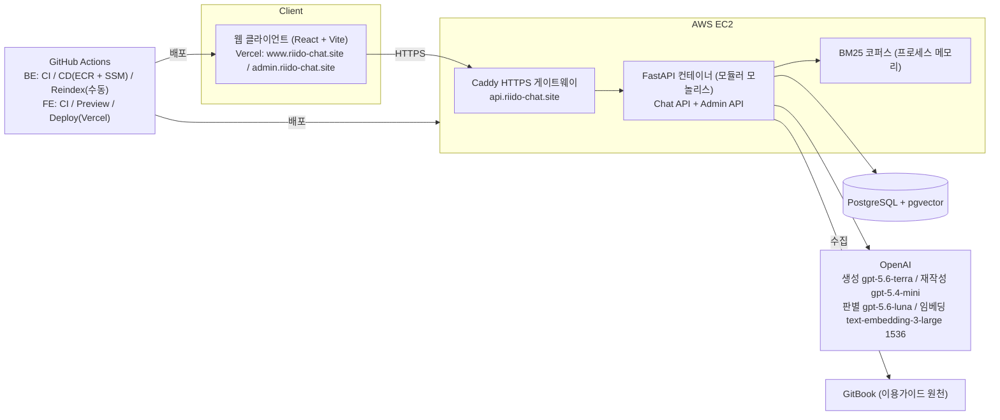
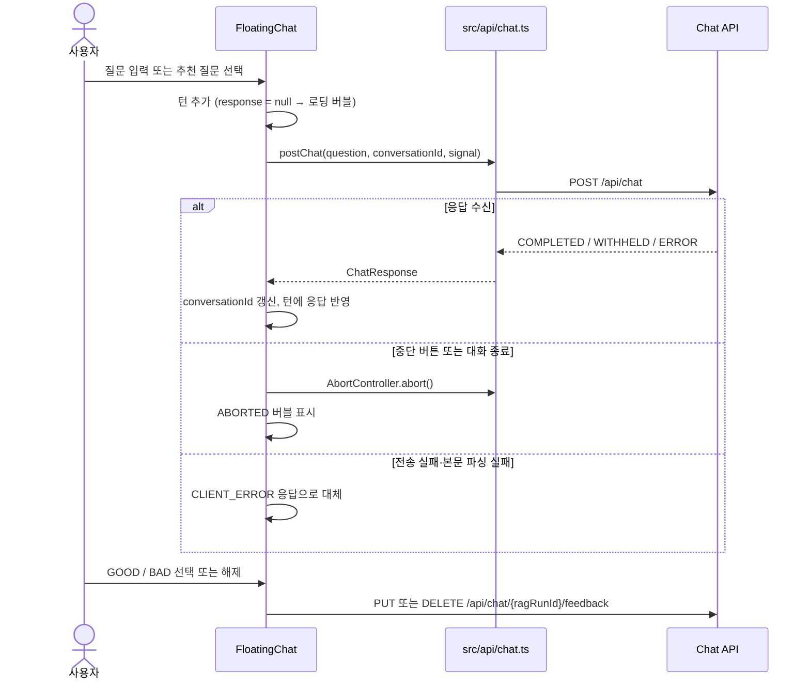

# 뤼이도 이용가이드 RAG 챗봇

뤼이도 이용가이드를 근거로만 답하는 문서 기반(RAG) 서비스 사용 안내 챗봇.
주식회사 스위그(제품 뤼이도) 제안 과제로 2026-07-27 부터 8주간 4인 팀이 만든 웹 서비스다.
이 저장소는 챗봇 화면과 운영 콘솔을 담당하는 프론트엔드 저장소이며, 검색·답변 생성·콘솔 API 는 별도 백엔드 저장소에서 관리한다.

## 프로젝트 소개

**문제.** 브리핑은 이용가이드가 있어도 사용자가 겪는 문제를 탐색 비용, 반복 문의, 정착 실패 세 가지로 정의했다. 사용자는 가이드에서 답을 찾는 데 시간을 쓰고, 같은 질문이 반복해서 들어오며, 기능을 익히지 못한 채 이탈한다.

**서비스.** 사용자가 질문하면 챗봇이 이용가이드에서 관련 절을 찾아 근거(출처 번호)와 함께 답한다. 근거가 부족하면 답을 지어내지 않고 사유를 붙여 보류한다. 운영자는 콘솔에서 가이드 문서를 올리고 검색에 반영하며, 질문 로그를 세부 문제 단위로 보고 승인된 정본 답변을 캐시로 서빙할 수 있다.

**주요 목표**

- 한국어 형태소 BM25 와 벡터 검색을 RRF 로 결합한 하이브리드 검색으로 가이드 절을 찾는다.
- 서버가 인용을 검증한 답변만 내보내고, 근거가 부족하면 사유 4종 중 하나로 보류한다.
- 멀티턴 후속 질문, 근거 보기, 답변 피드백까지 MVP 흐름을 완결한다.
- 대화·검색·모델 호출·인용·피드백을 실행 단위로 기록한다.
- 임베딩·생성 모델은 같은 평가셋으로 비교해 수치와 비용을 근거로 선택한다.

**개선 완료 목표**

- 고도화 1차 — 운영 콘솔 문서 관리: 운영자가 개발자 없이 문서 업로드·수정본 업로드·GitBook 수집·검색 반영을 수행하고, 색인은 검증을 통과해야 원자적으로 교체된다.
- 고도화 2차 — 질문 로그와 정본 캐시: 질문을 세부 문제로 판별·집계하고, 승인된 정본은 검증 게이트를 거쳐 서빙한다. 추천 질문은 정확 일치 캐시로 즉시 응답하고 세부 문제별 정본 답변을 준비했다.

## 기술 스택

**Frontend**


**Backend**


**Database · Search**


**LLM · Embedding**


**Infra · CI/CD**


## 팀 구성

| 항목      | 내용                                                                                                                                      |
| --------- | ----------------------------------------------------------------------------------------------------------------------------------------- |
| 팀명      | 스위그 2팀                                                                                                                                |
| 기간      | 2026-07-27 부터 8주, 최종 발표 2026-09-18                                                                                                 |
| 협업 방식 | 뤼이도 티켓(2-NNN) 단위 작업, PR 단위 병합과 CI 검증, Figma 화면·상태-문구 매핑을 SSoT 로 공유, 멘토링 8회차와 담당 기업 피드백 3·6·8주차 |

<table>
  <tr>
    <td align="center"><a href="https://github.com/Ji-minhyeok"></a><br/><b>지민혁</b></td>
    <td align="center"><a href="https://github.com/codedbyminjae"></a><br/><b>김민재</b></td>
    <td align="center"><a href="https://github.com/unanbb"></a><br/><b>이윤환</b></td>
    <td align="center"><b>노현지</b><!-- GitHub ID 생성 뒤 프로필 링크 추가 --></td>
  </tr>
  <tr>
    <td align="center">팀장 · BE · 인프라 · PM/PO</td>
    <td align="center">BE · RAG</td>
    <td align="center">FE</td>
    <td align="center">UX/UI</td>
  </tr>
  <tr>
    <td>로깅·ERD, CI/CD·게이트웨이·도메인, 운영 콘솔 문서 관리 API, 질문 로그 콘솔 API, 질문 판별·정본 캐시 서빙, 범위 재정의·주차 목표</td>
    <td>문서 파이프라인(GitBook 수집), 검색(BM25·벡터·RRF), 답변 생성·인용 검증, 멀티턴, 임베딩·생성 모델 비교 평가</td>
    <td>채팅 UI, 근거 보기, 피드백, 운영 콘솔 화면, Vercel 배포</td>
    <td>Figma 디자인 시스템, 챗봇·운영 콘솔·질문 로그 화면 설계</td>
  </tr>
</table>

## 시스템 구조



| 구성 요소                         | 책임                                                                                                                                                      |
| --------------------------------- | --------------------------------------------------------------------------------------------------------------------------------------------------------- |
| 웹 클라이언트 (이 저장소, Vercel) | 챗봇 화면(`www.riido-chat.site`)과 운영 콘솔(`admin.riido-chat.site`). develop push 시 Vercel Production 자동 배포, PR 마다 Preview 배포                  |
| Caddy 게이트웨이                  | `api.riido-chat.site` HTTPS 종단, 내부 운영 경로 외부 차단, API 컨테이너로 리버스 프록시                                                                  |
| FastAPI 컨테이너 (백엔드 저장소)  | Chat API·Admin API·내부 API 를 단일 컨테이너로 제공. Chat/Admin/Indexer 분리는 트래픽·운영 요구 발생 시 재검토                                            |
| PostgreSQL + pgvector             | 문서·절·청크·임베딩, 색인 버전, 대화·실행 로그, 질문 그룹핑·정본                                                                                          |
| BM25 코퍼스                       | 호스트 볼륨을 읽기 전용 마운트해 프로세스 메모리에 적재. Redis 없이 단일 인스턴스로 운영                                                                  |
| OpenAI                            | 답변 생성(terra), 질문 재작성(mini), 질문 판별(luna), 임베딩(text-embedding-3-large 1536차원)                                                             |
| GitHub Actions                    | 백엔드: PR 마다 CI, develop push 시 ECR 이미지 빌드·SSM 배포, 재색인은 수동 실행. 프론트엔드: PR 마다 CI 와 Preview 배포, develop push 시 Production 배포 |

## 주요 기능

**챗봇 (MVP)**

- 질문을 받으면 Kiwi 형태소 BM25 와 pgvector 벡터 검색을 RRF 로 결합해 가이드 절을 찾는다. 2026-09-08 평가(문서 39개·청크 142개·질문 30문항)에서 Recall@5 96.67%, Recall@10 100%.
- 답변은 서버가 인용을 검증한 뒤 한 번에 내보낸다. 완료 답변에는 최소 1개 인용이 붙고, 본문에는 링크·HTML·내부 식별자를 넣지 않는다.
- 근거가 부족하면 INSUFFICIENT_EVIDENCE / AMBIGUOUS_QUESTION / OUT_OF_SCOPE / UNVERIFIABLE_ANSWER 사유로 보류하고, 보류 시에도 관련 가이드 섹션을 안내한다.
- 후속 질문은 대화 맥락을 붙여 재작성하며(최대 5턴), 답변에 GOOD/BAD 피드백을 남길 수 있다.

**운영 콘솔 문서 관리 (고도화 1차)**

- 문서 그룹 단위로 신규 업로드, 수정본 업로드, GitBook 수집, 검색 반영을 콘솔 버튼으로 수행한다.
- 업로드는 sha256 해시로 NO_CHANGE / 수정본 / 중복 / 신규를 판정하고, 같은 그룹 작업은 하나만 동시 실행된다.
- 검색 반영은 BUILDING→VALIDATING→APPLYING 을 모두 통과해야 새 색인이 ACTIVE 로 교체된다. 상태값은 UP_TO_DATE / REINDEX_REQUIRED / IN_PROGRESS / NO_DOCUMENTS / FAILED.

**질문 로그와 정본 캐시 (고도화 2차)**

- 질문을 세부 문제 단위로 판별해 대시보드·문서별·세부 문제별로 집계하고, 답변 상태(ANSWERED / CACHED_ANSWER / WITHHELD / ERROR)로 필터한다.
- 승인된 정본은 판별 결과·정본 버전·인용 유효성·서빙 상태를 검사하는 게이트를 거쳐서만 서빙된다. SHADOW 상태에서는 시도 결과만 기록한다.
- 골든셋(질문 96문항·세부 문제 30개·정본 30개·대표 질문 60개)으로 세부 문제 적중 129/136, 오수락 2/56 기준선을 관리한다.
- 추천 질문은 정확 일치 캐시로 즉시 응답한다.

## 협업 방식

- 뤼이도 작업 항목(2-NNN)을 브랜치·PR 에 대응시키고, PR 은 CI(포맷·린트·타입 검사·빌드)를 통과해야 develop 에 병합한다. PR 마다 Preview 배포 URL 이 댓글로 달린다.
- 화면은 Figma 페이지, 상태-문구 매핑은 별도 문서를 SSoT 로 두고 옛 문서는 폐기했다.
- 멘토링 피드백(ERD 구조, 보류 완화, 모델 비교 등)과 담당 기업 요청을 병합 PR 로 추적할 수 있게 대응했다.
- 브리핑 요구를 MVP / 1차 / 2차 / 제외로 재정의하고 주차 목표(3주 최소 구현, 4주 MVP, 5주 안정화, 6주 콘솔, 7주 분석·성능, 8주 검증)를 문서로 확정했다.

## 고도화 로드맵

- 정본 캐시 운영 전환: SHADOW 관찰 → 세부 문제별 SERVING 전환 → 프로필 캐시 켜기 순으로 단계적 적용. 과거 턴 소급 분류와 사용자 원문 표시는 후속 과제.
- 콘솔 화면: 자주 묻는 질문 Top·무응답 질문 목록 화면(API 는 운영 중), 질문 로그 2차 화면(디자인 있음). 질문 로그 1차 화면(대시보드·문서 목록·문서 상세·질문 목록)은 구현을 마쳤고, 조회 대상 문서 그룹 선택(현재 목록의 첫 그룹)은 후속 과제.
- 문서 관리: 문서 버전 조회/롤백/삭제, 색인 수동 적용, 다중 인스턴스 동기화, 재색인 CLI 정리.
- 기업 요청 중 미대응: URL 매핑, 개념 질문 외부 URL 연결(본문 링크 금지 정책과 상충), 콘솔 "마지막 업데이트" 표시·주기 갱신.
- 그 밖: 실제 인증 연동(현재 mock, 콘솔 라우트에도 인증 가드 없음), 비용 최적화, 캐시로 생략된 비용 측정(실제 반복률 필요), 추천 질문 목록 확정(현재 프론트엔드 정적 데이터), FE E2E 테스트, LLM·임베딩 제공자 비결합 인터페이스.

---

## 프론트엔드

### 기술 스택 상세

| 영역          | 선택                                                                                                  | 용도                                                                        |
| ------------- | ----------------------------------------------------------------------------------------------------- | --------------------------------------------------------------------------- |
| 언어·빌드     | TypeScript ~6.0, Vite 8.2, `@vitejs/plugin-react`                                                     | `tsc -b` 타입 검사 후 Vite 빌드. `@` 별칭이 `src/` 를 가리킨다              |
| UI            | React 19.2, react-router 7.18(`createBrowserRouter`)                                                  | 챗봇 화면과 운영 콘솔을 한 앱에서 호스트 이름으로 나눠 제공                 |
| 스타일        | Tailwind CSS 4.3(`@tailwindcss/vite`), tw-animate-css, Pretendard                                     | `src/index.css` 의 `@theme` 에 Figma 디자인 토큰(`rc-` 색상 등)을 정의      |
| 컴포넌트      | shadcn(`base-nova` 스타일) + Base UI, class-variance-authority, tailwind-merge                        | `src/components/common/` 에 버튼·다이얼로그·탭·툴팁 등 공통 컴포넌트를 둔다 |
| 마크다운      | react-markdown 10                                                                                     | 챗봇 답변 본문(`answerMarkdown`) 렌더링                                     |
| 아이콘·에셋   | react-icons, vite-plugin-svgr(`*.svg?react`), WebP 애니메이션                                         | 아이콘 컴포넌트화, 홈 캐릭터·로딩 스피너                                    |
| 컴포넌트 문서 | Storybook 10.5(`@storybook/react-vite`)                                                               | 채팅 버블·입력창·출처 배지·탭 등 컴포넌트 단위 확인                         |
| 코드 품질     | ESLint 10(typescript-eslint, react-hooks, storybook), Prettier 3.9(+tailwindcss 플러그인), Lefthook 2 | 커밋 전 검사와 CI 검사를 같은 명령으로 맞춘다                               |
| 배포          | Vercel CLI + GitHub Actions                                                                           | develop push 시 Production, PR 마다 Preview 배포                            |

서버 상태 관리 라이브러리는 쓰지 않는다. API 호출은 `fetch` 를 감싼 모듈(`src/api/`)과 조회 훅(`useConsoleFetch`)으로 처리한다.

### 주요 기능 상세

#### 챗봇

- 플로팅 채팅: 챗봇 화면 오른쪽 아래 버튼으로 채팅창을 열고 닫는다. 한 번 연 뒤에는 닫아도 대화를 유지하고, 채팅창은 홈 → 추천 질문 펼침 → 대화 세 가지 보기로 전환된다.
- 추천 질문: 카테고리 탭별 추천 질문을 누르면 바로 질문으로 전송한다. 추천 질문 목록은 현재 `src/mocks/recommendedQuestions.ts` 의 정적 데이터다.
- 질문 전송: `POST /api/chat` 에 질문과 `conversationId` 를 보내고 동기 JSON 응답을 받는다. 서버가 내려준 `conversationId` 로 후속 질문의 대화 맥락을 이어 간다.
- 응답 상태별 화면: COMPLETED 는 마크다운 답변과 출처 번호 배지, WITHHELD 는 보류 사유 코드별 안내 문구와 관련 가이드 섹션 배지, ERROR 는 오류 안내를 보여 준다. `retryable` 이 참이면 재시도 버튼을 띄우며, 재시도는 서버가 인식하는 대화 순서를 지키기 위해 마지막 턴에서만 허용한다.
- 답변 대기: 로딩 버블이 "관련 내용 확인 중 → 답변 생성 중 → 답변 정리 중" 문구를 5초 간격으로 바꿔 보여 준다.
- 중단과 대화 종료: 중단 버튼은 `AbortController` 로 요청을 끊고 클라이언트 전용 ABORTED 상태로 표시한다. 대화 종료는 진행 중인 요청을 끊고 대화 식별자를 폐기한 뒤 홈으로 돌아간다.
- 피드백: 완료·보류 답변에 GOOD/BAD 를 `PUT /api/chat/{ragRunId}/feedback` 으로 등록·변경하고, `DELETE` 로 해제한다. 두 호출 모두 서버에서 멱등 처리된다.
- 고도화/개선 사항: 보류 시 관련 가이드 섹션 표시(#95), 응답 대기 문구 단계화(#114), 홈 캐릭터 애니메이션(#112), 재시도 가능 여부 분기(#60), 답변 중단 버튼(#54).

#### 운영 콘솔 문서 관리

- 문서 그룹 목록과 그룹 상세(요약, 수집 원천, 문서 표)를 조회한다. 문서 수·검색 반영 상태·대기 건수는 서버가 계산한 값을 그대로 표시한다.
- 문서 업로드 모달은 신규 업로드(`POST /api/admin/document-groups/{groupId}/documents`, 파일 + 문서명)와 수정본 업로드(`POST /api/admin/documents/{documentId}/versions`, 파일만)를 multipart 로 나눠 보낸다. `UploadResultDialog` 가 성공과 실패 결과를 함께 보여 준다.
- 검색 반영 모달(`ReindexDialog`)은 확인 → 진행 중 잠금 → 완료 또는 실패의 단계로 진행한다. 다시 시도는 같은 호출을 반복한다.
- GitBook 수집 모달(`GitbookSyncDialog`)은 루트 URL 을 받아 수집을 실행하고, `GitbookSyncResultDialog` 가 성공·실패 집계와 오류를 보여 준다.
- 업로드·검색 반영·GitBook 수집은 서버가 동기로 처리한 뒤 응답하므로 진행률 없이 잠금 화면을 유지하고, 실행이 끝나면 배경의 그룹 상세를 재조회한다.
- 콘솔 API 오류는 서버의 `{ code, message }` 형식을 그대로 받아 `message` 를 화면 문구로 쓰고, `code` 로는 표시할 화면만 정한다. 게이트웨이가 먼저 끊은 응답(5MB 초과 413 등)이나 전송 실패는 INTERNAL_ERROR 기본 문구로 맞춘다.
- 고도화/개선 사항: 업로드 모달 구조 변경(#78), 검색 반영 모달(#82), GitBook 수집 모달(#88), 문서 관리 API 연동과 콘솔 목 제거(#90).

#### 질문 로그

- 대시보드: 문서 그룹의 전체 누적 질문을 상단 지표, 자주 묻는 세부 문제, 답변 보류가 많은 문서로 보여 주고, 문서 목록과 최근 질문 3건을 미리 보여 준다.
- 문서 목록·문서 상세: 문서마다 질문 수·보류 수·세부 문제 수를 서버가 정렬한 순서대로 보여 주고, 문서 상세에서는 세부 문제별 적용 상태(승인 정본 유무)를 보여 준다. 행을 펼치면 정본 답변 본문, 적용 범위 규칙, 세부 문제에 속한 질문을 한 번에 한 행씩 확인한다.
- 질문 목록: 답변 상태(ANSWERED / CACHED_ANSWER / WITHHELD / ERROR), 문서, 세부 문제 유무, 검색어(100자 이하)로 필터하고 20건 단위로 페이지를 넘긴다.
- 조회 대상 그룹: 챗봇에 연결된 그룹을 식별하는 API 가 아직 없어 문서 그룹 목록의 첫 그룹을 임시 대상으로 삼고, 화면에 그룹명을 표시해 전체 집계로 오인하지 않게 한다.
- 고도화/개선 사항: 질문 로그 대시보드·문서 목록·문서 상세·질문 목록 화면(#118).

### 요청 처리 흐름



- 서버가 ERROR 본문을 내려준 경우(404, 422, 500, 503)에는 HTTP 상태와 관계없이 그 본문을 그대로 화면에 반영한다.
- 운영 콘솔 조회는 `useConsoleFetch` 가 조회 중·성공·실패 상태를 관리한다. 화면을 떠나면 요청을 중단하고, 재조회가 실패해도 이미 보고 있던 데이터는 유지한다.

### 화면 구성과 라우팅

| 도메인                  | 경로                                   | 화면                                          |
| ----------------------- | -------------------------------------- | --------------------------------------------- |
| `www.riido-chat.site`   | `/`                                    | 챗봇 홈과 플로팅 채팅                         |
| `admin.riido-chat.site` | `/`                                    | `/document-groups` 로 이동                    |
|                         | `/document-groups`                     | 문서 그룹 목록                                |
|                         | `/document-groups/:groupId`            | 문서 그룹 상세(업로드·검색 반영·GitBook 수집) |
|                         | `/question-logs`                       | 질문 로그 대시보드                            |
|                         | `/question-logs/documents`             | 질문 로그 문서 목록                           |
|                         | `/question-logs/documents/:documentId` | 질문 로그 문서 상세                           |
|                         | `/question-logs/questions`             | 질문 목록                                     |

- 라우터는 `window.location.hostname` 이 `admin.riido-chat.site` 이면 콘솔 라우트만, 그 밖의 호스트에서는 챗봇 라우트만 등록한다.
- 개발 서버에서는 콘솔을 `/console` 아래와 루트 경로 양쪽에 함께 등록한다. 콘솔 안의 링크가 운영 도메인 기준 절대 경로이기 때문이다.
- `vercel.json` 은 모든 경로를 `index.html` 로 되돌려 SPA 라우팅을 지원하고, `riido-chat.site/console/*` 요청을 `admin.riido-chat.site` 로 영구 이동시킨다.

### 로컬 실행

```bash
npm ci               # Node 24 권장(CI 22, Vercel 배포 24). prepare 단계에서 Lefthook 훅이 설치된다
npm run dev          # Vite 개발 서버 (챗봇: /, 운영 콘솔: /console)
npm run storybook    # Storybook (http://localhost:6006)
```

환경변수는 `VITE_API_URL` 하나다. 백엔드 API 주소를 프로젝트 루트의 `.env.local` 에 적는다. 로컬 백엔드를 8000번 포트에서 실행한다면 `VITE_API_URL=http://localhost:8000`으로 설정한다. 비어 있으면 요청이 현재 도메인 기준 상대 경로(`/api/...`)로 나간다. API 출처가 다르면 백엔드 CORS 설정에 개발 서버 주소를 허용해야 한다.

### 품질 검사

```bash
npm run format:check   # Prettier
npm run lint           # ESLint
npm run type-check     # tsc -b --noEmit
npm run build          # tsc -b && vite build
```

- 커밋 전: Lefthook 이 스테이징된 파일에 Prettier·ESLint 검사를 돌리고, TS 파일이 바뀌면 전체 타입 검사를 병렬로 실행한다.
- CI(`.github/workflows/ci.yml`): develop/main 대상 PR 과 develop push 마다 위 네 명령을 순서대로 실행한다(Node 22).
- 자동화된 단위·E2E 테스트는 아직 없고, 컴포넌트는 `src/stories/` 의 Storybook 스토리로 확인한다.

### 배포 자동화

```text
[PR → develop/main]   ci.yml       npm ci → format:check → lint → type-check → build
                      preview.yml  vercel build (VITE_API_URL 저장소 변수 주입) → 빌드 산출물 업로드
                                   → vercel deploy --prebuilt → PR 에 Preview URL 댓글
[push develop]        ci.yml       PR 과 같은 검사
                      deploy.yml   vercel pull (production 환경) → vercel build --prod → vercel deploy --prebuilt --prod
```

| 파일                            | 역할                                                                                   |
| ------------------------------- | -------------------------------------------------------------------------------------- |
| `.github/workflows/ci.yml`      | 포맷·린트·타입 검사·빌드                                                               |
| `.github/workflows/preview.yml` | 같은 저장소의 PR 만 Preview 배포. 빌드와 배포 잡을 나눠 배포 잡에만 Vercel 토큰을 전달 |
| `.github/workflows/deploy.yml`  | develop push 시 Vercel Production 배포. 동시 실행 시 이전 배포를 취소                  |
| `vercel.json`                   | SPA rewrite, 콘솔 경로의 운영 도메인 리다이렉트                                        |

운영 상태: develop 에 병합된 변경은 `deploy.yml` 로 Vercel Production 에 자동 배포되며, 같은 배포가 `www.riido-chat.site` 와 `admin.riido-chat.site` 두 도메인을 함께 서빙한다.

### 디렉터리 구조

```text
src/
├── main.tsx, App.tsx    # 진입점, TooltipProvider + RouterProvider
├── index.css            # Tailwind 테마, 디자인 토큰, 전역 스타일
├── api/                 # chat.ts(질문·피드백), console.ts(문서 관리·질문 로그, 오류 변환)
├── assets/              # SVG 아이콘, WebP 애니메이션, 이미지
├── components/
│   ├── chat/            # 플로팅 채팅, 채팅 턴·버블, 보류·오류·로딩, 출처 배지, 추천 질문, 피드백
│   ├── common/          # shadcn 기반 공통 UI(button, dialog, tabs, tooltip, message-scroller 등)
│   └── console/         # 콘솔 레이아웃·표·모달(업로드, 검색 반영, GitBook 수집)·상태 배지
├── hooks/               # useConsoleFetch, 업로드·검색 반영·GitBook 수집 모달 흐름 훅
├── lib/                 # cn 유틸, 콘솔 표시 문구·포맷터
├── mocks/               # 추천 질문 정적 데이터, Storybook 용 예시 응답
├── pages/               # HomePage, console/ (문서 그룹 목록·상세, 질문 로그 4개 화면)
├── routes/              # router(호스트별 라우트 분기), RootLayout, ConsoleLayout
├── stories/             # Storybook 스토리
└── types/               # chat.types.ts, console.types.ts (API 요청·응답 타입)
```
